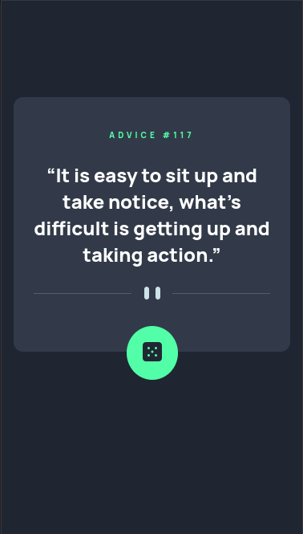
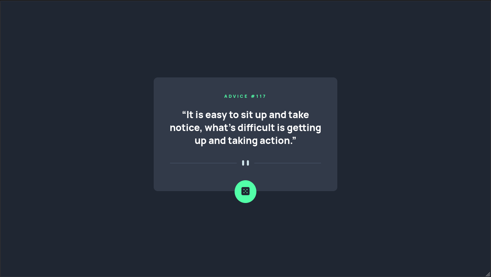

# Frontend Mentor - Advice generator app solution

This is a solution to the [Advice generator app challenge on Frontend Mentor](https://www.frontendmentor.io/challenges/advice-generator-app-QdUG-13db). Frontend Mentor challenges help you improve your coding skills by building realistic projects.

## Table of contents

- [Overview](#overview)
  - [The challenge](#the-challenge)
  - [Screenshot](#screenshot)
  - [Links](#links)
- [My process](#my-process)
  - [Built with](#built-with)
  - [What I learned](#what-i-learned)
  - [Useful resources](#useful-resources)
- [Author](#author)

## Overview

### The challenge

Users should be able to:

- Read advices fetched from the Advice Slip API

### Screenshot

#### Mobile



#### Desktop



### Links

- Solution URL: [https://www.frontendmentor.io/solutions/responsive-advice-generator-3T9fbWqi5](https://www.frontendmentor.io/solutions/responsive-advice-generator-3T9fbWqi5)
- Live Site URL: [Github Pages](https://hydenz.github.io/advice-generator/)

## My process

### Built with

- Semantic HTML5 markup
- Flexbox
- Mobile-first workflow
- [React](https://reactjs.org/) - JS library

### What I learned

It is possible to disable cache in fetch API by passing a configuration object to the function call

```js
const response = await fetch("https://api.adviceslip.com/advice", {
  cache: "no-store",
});
```

### Useful resources

- [CSS Loaders](https://loading.io/css/) - This helped me to use a simple CSS Loader component.
- [Fetch Cache](https://stackoverflow.com/questions/29246444/fetch-how-do-you-make-a-non-cached-request) - This stackoverflow thread helped me to disable caching in fetch requests.

## Author

- Github - [Profile](https://github.com/hydenz)
- Frontend Mentor - [@hydenz](https://www.frontendmentor.io/profile/hydenz)
- Twitter - [@hydenz99](https://twitter.com/hydenz99)
